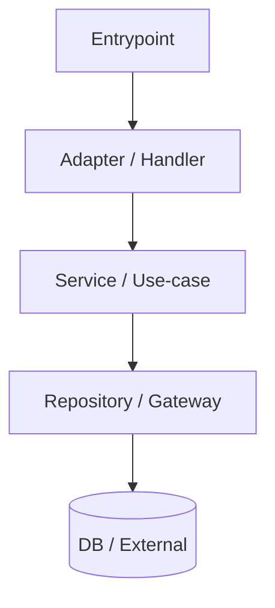
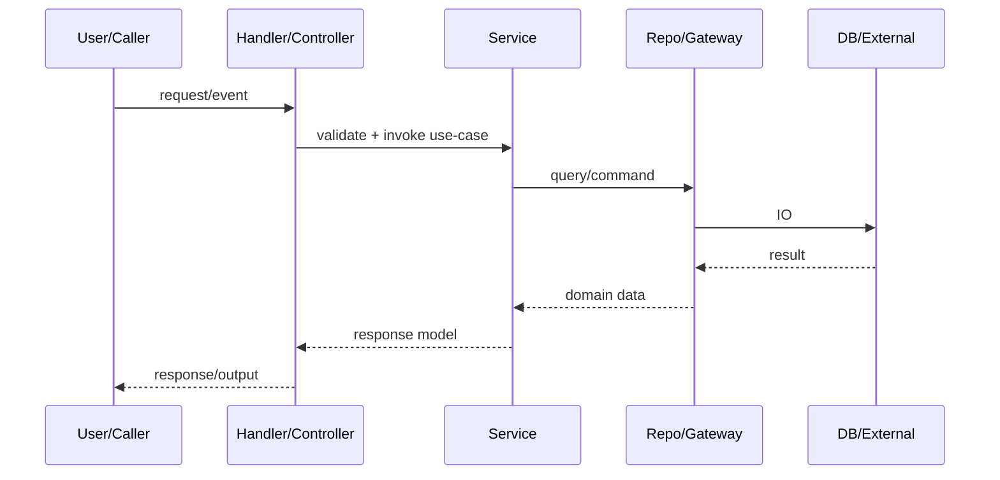

# Design Flow Explorer
ultrathink

## Goal
Help the user **grok the codebase design**, especially the **end-to-end flow**:
- what the major components/layers are
- how a request/event moves through them
- where the important abstractions live
- what files to read (in order) to understand it quickly

## Input
The user will invoke: `/design-flow $ARGUMENTS`

Interpret `$ARGUMENTS` as:
- **topic/feature** (e.g., `login`, `checkout`, `csv import`, `sync worker`)
- or an **entrypoint/file** (e.g., `src/server.ts`, `apps/api/main.go`)
- optionally includes **depth**: `overview` (default) or `deep`
- optionally includes **diagram format**: `mermaid` (default) or `ascii`

If unclear, default to **repo-level overview** and state assumptions explicitly.

## Method (do this in order)
1) **Find existing design truth**
   - Look for: README, docs/, ARCHITECTURE.md, /adr, /decisions, diagrams, "RFC", "design", "architecture"
   - Summarize any stated architecture patterns (e.g., MVC / hexagonal / DDD / CQRS / event-driven).
   - If docs conflict with code, say so.

2) **Identify system boundaries + layers**
   - Map top-level packages/apps/services and their responsibilities.
   - Identify "edges" (HTTP handlers, CLI entrypoints, message consumers, cron jobs) and "core" (domain/services).
   - Note data layer(s): DB access, ORM, repositories, migrations, schema definitions.

3) **Trace one representative end-to-end flow**
   - Pick the most central flow for the topic:
     - HTTP request path OR event/queue consumer OR CLI command OR background job
   - Trace: entrypoint → routing/handler → validation → domain/service → data access → side effects → response/output
   - Use Grep to follow function/class usage and key identifiers.
   - Read only what you need; prefer Grep/Glob first, then Read.

4) **Extract the design "shape"**
   - Key interfaces/abstractions and why they exist
   - Invariants (must always be true), state transitions, failure modes
   - Cross-cutting concerns: authn/authz, logging, metrics, retries, transactions, idempotency

5) **Produce a guided reading order**
   - Give a curated list of files to read (8–15), in order.
   - For each file: "why it matters" + what to look for (symbols/functions/types).
   - Include concrete file paths; include line ranges if visible.

## Output format (always follow)
Return a markdown report with these sections:

1) **One-screen summary**
   - 5–10 bullets: components, boundaries, primary flow, and "where to start".

2) **Architecture map**
   - Short description of layers/modules and responsibilities
   - Mention major frameworks/libraries only if verified from repo files

3) **Design flow narrative (step-by-step)**
   - Numbered steps from entrypoint to outcome
   - Include file pointers and symbol names

4) **Diagram(s)**
   - If format is `mermaid`, include:
     - a `flowchart` showing components/modules
     - a `sequenceDiagram` for the main flow
   - If format is `ascii`, include compact ASCII diagrams

5) **Key data + state**
   - Important types/models/tables/messages
   - State machine notes (if any)

6) **Extension points**
   - Where to add a feature safely
   - What to avoid breaking

7) **Reading list**
   - Ordered list with file paths + rationale

8) **Open questions / uncertainties**
   - Only include what you couldn't verify quickly
   - Provide 2–5 targeted questions the user could answer to refine the map

## Diagram templates

### Mermaid flowchart template

### Mermaid sequence template

## Style rules

* Be specific. Prefer "`path/to/file.ts` → `functionName()`" over vague statements.
* Do not guess. If you infer, label it as an inference.
* Keep it skimmable: headings + bullets + short paragraphs.
